# Alertstack

A self-contained local observability stack for developing and testing [Prometheus](https://prometheus.io/) alert rules, [Alertmanager](https://prometheus.io/docs/alerting/latest/alertmanager/) configs, and [Grafana](https://grafana.com/) dashboards before they touch any shared environment.

# Quickstart

> **Prerequisite:** add `alertstack.org` to `/etc/hosts` (used as the local domain throughout):
>
> ```bash
> sudo sh -c 'echo "127.0.0.1 alertstack.org" >> /etc/hosts'
> ```

<details open>
<summary><strong>Clone, build and run</strong>

```bash
git clone https://github.com/rondomondo/alertstack.git && cd alertstack

# copy the env template and adjust credentials if desired
cp .env.template .env

# build images, generate a self-signed TLS cert, and start all five services
make stack-up

# see copy-pasteable examples
make examples
```
</summary>

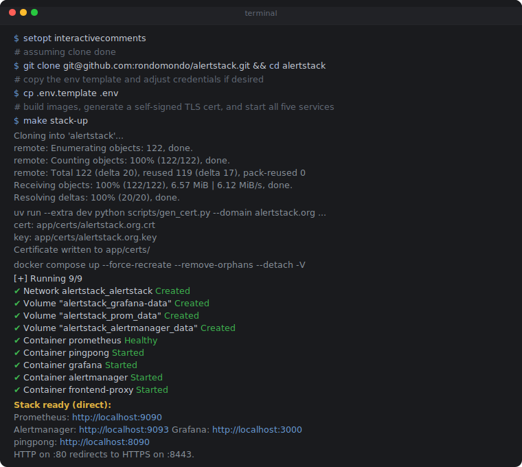

</details>

Once the stack is up, all services are reachable through the Envoy HTTPS proxy:

```
https://alertstack.org:8443/prometheus/   -> Prometheus
https://alertstack.org:8443/alertmanager/ -> Alertmanager
https://alertstack.org:8443/grafana/      -> Grafana
https://alertstack.org:8443/              -> pingpong
```

> **Chrome TLS warning:** with a self-signed cert Chrome may block the page. Click anywhere on the page and type `thisisunsafe` to proceed.

<details>
<summary>More on the TLS/SSL Certificate Warning on Chrome</summary>

When using a self signed cert you might see a warning like the following. See the details below on the workaround.

<table>
  <tr>
    <td>&#x26A0;&#xFE0F; Chrome Self-Signed<br>&nbsp;&nbsp;&nbsp;&nbsp;&nbsp;Certificate Warning</td>
    <td>

[NET::ERR_CERT_AUTHORITY_INVALID]
</td>
  </tr>
  <tr>
    <td width="33%">
    <strong>When visiting an HTTPS endpoint</strong>
    Chrome may block the page with a security warning.<br><br>To bypass it, click anywhere on the browser window and type <code>thisisunsafe</code> (no spaces) then the page will load immediately.</td>
    <td width="70%"><a href="https://chromium.googlesource.com/chromium/src/+/d8fc089b62cd4f8d907acff6fb3f5ff58f168697/components/security_interstitials/core/browser/resources/interstitial_large.js#19"></a></td>
  </tr>
</table>

</details>

<br>

---

# Overview

Alert rules and Alertmanager configs in real environments are tightly coupled YAML files that accumulate across teams and vintages. Editing them safely means a full develop-merge-deploy-test cycle against staging before you know if they even parse correctly.

Alertstack short-circuits that loop. Run the full stack locally, inject synthetic metrics via [`pingpong`](app/pingpong.go), and validate rule syntax, routing logic, and notification templates in isolation - without touching a shared environment.

<details>
<summary><strong>Git workflow - how alertstack fits into a GitOps observability pipeline</strong></summary>

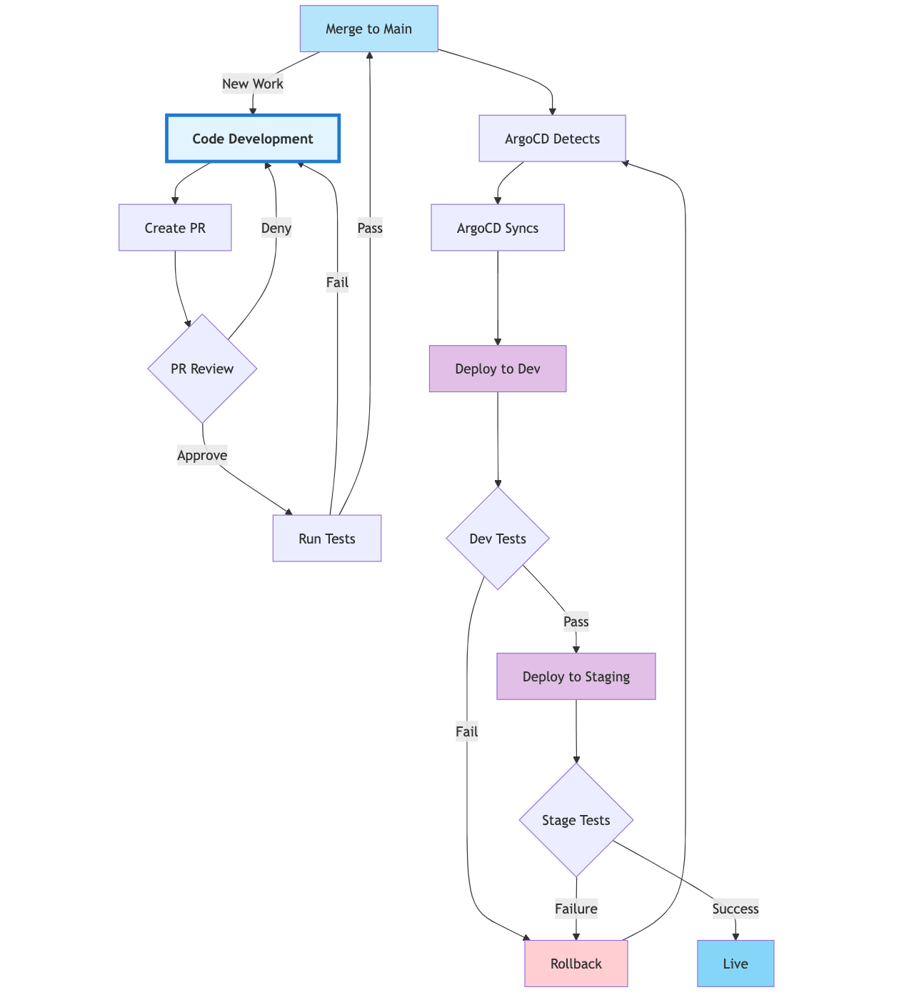

</details>

The stack runs five services via [docker-compose], all behind a single Envoy reverse proxy:

### [`pingpong`](app/pingpong.go)
This is a toy service/application written in golang. It provides test [integration endpoints](https://prometheus.io/docs/alerting/latest/configuration/#receiver) for /pagerduty /slack and /webhooks. It also provides a proxy stub for the [/metrics](https://prometheus.io/docs/prometheus/latest/querying/api/#targets) API endpoint so we can see what exactly prometheus is scraping, and when.

This endpoint also allows for the cloning of any existing metrics in this standalone environment. Input can be both JSON and the [Prometheus Client Exposition Format] (which is compatible with the [openmetrics] project). In our go application the metrics are implemented using the Prometheus and [Victoria Metrics](https://victoriametrics.com/) golang client libraries. We use these to allow simulation of actual metrics gathering for testing.

See the [metrics examples and usage](app/test/examples.sh) for more. The Pingpong app exposes various endpoints like...

```bash
# the basic endpoints exposed (all via the Envoy HTTPS proxy)
curl -k https://alertstack.org:8443/ping

curl -k https://alertstack.org:8443/metrics

curl -k https://alertstack.org:8443/create

curl -k https://alertstack.org:8443/update

curl -k https://alertstack.org:8443/echo

curl -k https://alertstack.org:8443/v2/enqueue
```

### [`frontend-proxy`](src/frontend-proxy/)
An [Envoy](https://www.envoyproxy.io/) reverse proxy that provides a single ingress point for the stack. HTTP on port 8080 redirects to HTTPS on port 8443; traffic is routed to each backend by path prefix (see routing table above). A [self-signed TLS certificate](scripts/gen_cert.py) is generated automatically on first run.

### Uniformity of the UI assets
You might notice the visual consistency of some notification UI elements. This is an attempt at standardisation of the actual alerting and action display templates that format the messages/events sent upstream to services like Pagerduty, Dynatrace, ServiceNow, Slack and elsewhere. Standardised so the look and key information look consistent to a responder no matter the service. Obvious advantages to this standardised look...

  + Simplifies the variation and inconsistencies that can occur in field names, message formats (pagerduty, slack, traces, mobile) across the various projects/yaml resources in an enterprise.
  + Reduce the complexity and redundancy of the various rules/alerts type files (env1.Alerts.xml, env2.Alerts.xml...) slowly over time.
  + Provide a dynamic and contextually relevant set of **_actionable_** links for responders: On-Call, SRE, IR, and others.
  + Automate insertion of Runbook, Logs, Grafana, Dashboard links with sensible fallbacks for default.
  + Reduce the amount of prior knowledge a responder needs to know to address alerted issues. Achieved through the insertion of all the relevant key information in the output formats. Demonstrated here by back links to Prometheus, Grafana, Alertmanager, Logs etc.
  + Faster mean time to repair [mttr] for incidents (also mean time to detect [mtt*] ).


### A few commands

Assuming the stack is up (`docker compose ps`) try the following

```bash

# sanity test
curl -k https://alertstack.org:8443/time

# attach some logs
make stack-logs

# Open another terminal window and try some of the example commands from this
make examples

# Create a metric to match a realistic one
cat app/test/envoy_upstream_rq.prom | curl -k --data-binary @- https://alertstack.org:8443/create

# Update that metric
cat app/test/envoy_upstream_rq.prom | curl -k --data-binary @- https://alertstack.org:8443/update

# List all the metric names it knows about thus far
curl -k -s https://alertstack.org:8443/metrics | prom2json | jq '.[].name'

# The WEB UI components are all accessible via the Envoy proxy. Start with looking at prometheus
https://alertstack.org:8443/prometheus/

# See the grafana dashboard (admin/grafana)
https://alertstack.org:8443/grafana/

# And the alertmanager
https://alertstack.org:8443/alertmanager/

# The traffic app pingpong has some actions
https://alertstack.org:8443/ping
```

<br>

> 💡 **Tip:** Use `make stack-logs` to monitor all interaction with the alertstack components.
> Particularly useful to see when other systems are calling or when alerts get triggered, as well as seeing the JSON prettified view of slack and pagerduty payloads.
>

<br><br>

<p>

### Checking out the stack configuration files

The main two files that are of interest would be the [prometheus/rules.yml](prometheus/rules.yml) file and [alertmanager/alertmanager.yml](alertmanager/alertmanager.yml)
<br>

| File | Purpose |
|------|---------|
| [prometheus/rules.yml](prometheus/rules.yml) | Define the fields, rules, and triggers for alerts |
| [alertmanager/alertmanager.yml](alertmanager/alertmanager.yml) | Define the set of receivers to be notified of an alert and under what circumstances |

<br>

<br>

## Aligning Output Template formats for Alerts
Notice we make extensive use of the [Notification Templates](https://prometheus.io/docs/alerting/latest/notifications/) for both Prometheus and Alertmanager. These help to format the output in a consistent way across Pagerduty, Slack and others. The objective is to make them look as similar as possible within the constraints of the features the relevant integration.

So these are actually [Go Templates](https://pkg.go.dev/text/template) that we use to customize our [Prometheus Templates](https://prometheus.io/docs/prometheus/latest/configuration/template_reference/) and also the [AlertManager templates](https://prometheus.io/docs/alerting/latest/notifications/)

Below is a realistic example of Alerts sent to PagerDuty and Slack of the same alert trigger. The key thing to notice is the similar field content and the inclusion of contextually relevant Dashboard, Runbook, Logs links...

<br>

Slack Warning Alert        |  Slack PagerDuty Alert
:-------------------------:|:-------------------------:
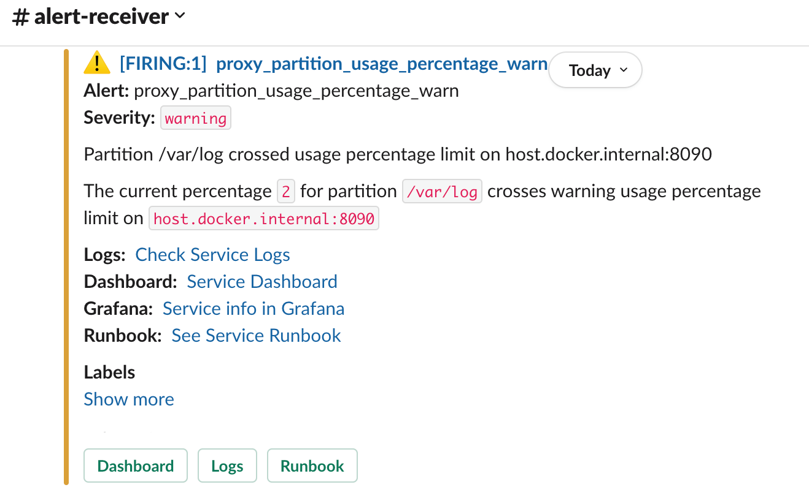 | 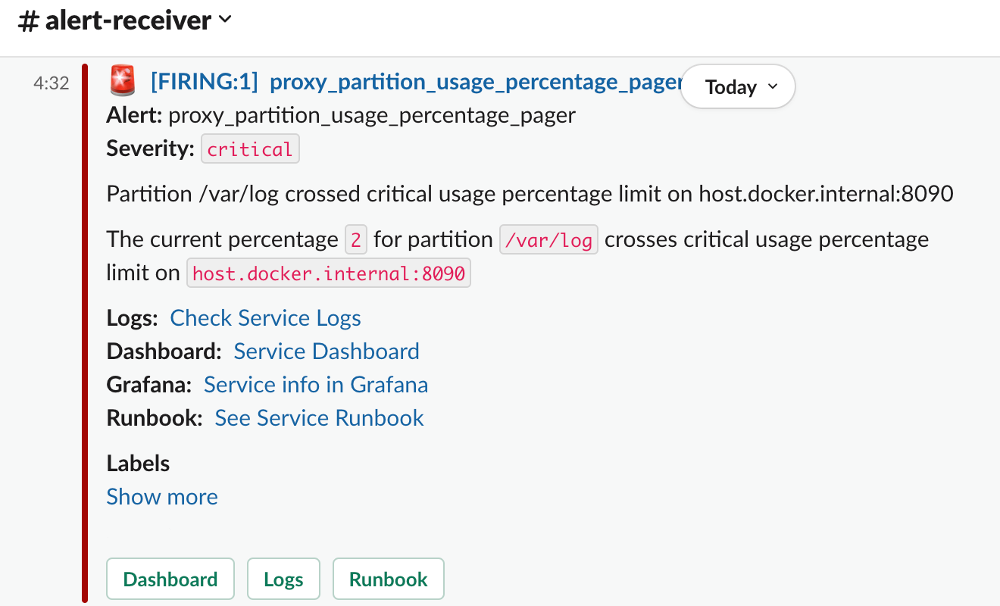
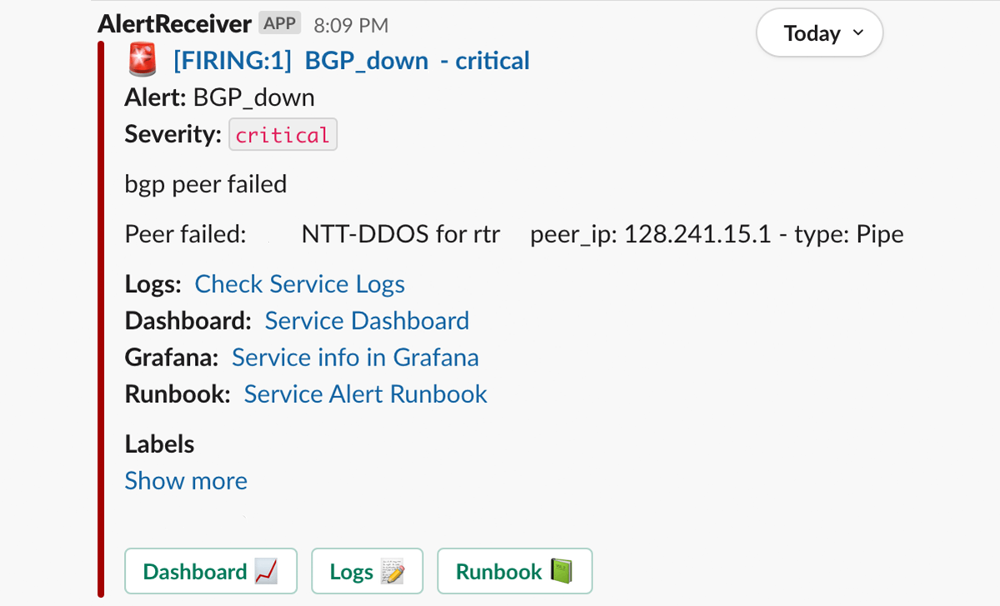 | 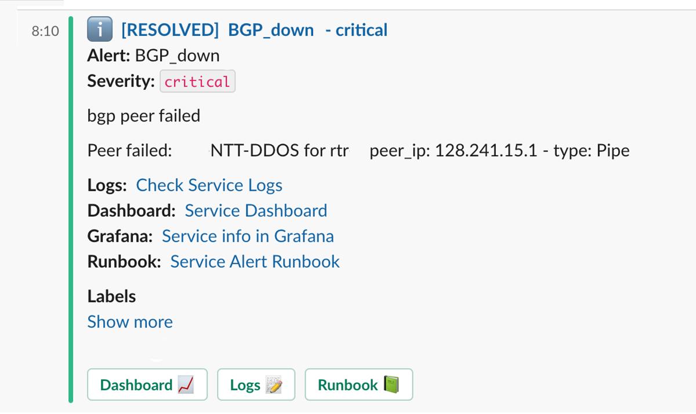

<br>

<hr>


## Project layout

<details>

<summary>This filetree describes the project lay out. You can run any part of this individually.</summary>

## Directory tree
As generated by [filetree](scripts/filetree)

```
.
    ├── .claudeignore
    ├── .env
    ├── .env.template
    ├── .githooks
    │   └── commit-msg
    ├── .gitignore
    ├── CLAUDE.md
    ├── Makefile
    ├── README.md
    ├── alertmanager
    │   ├── alertmanager.yml
    │   └── templates
    │       ├── default.tmpl
    │       ├── pagerDuty.tmpl
    │       ├── pagerDutyExtraGOD.tmpl
    │       ├── slack.tmpl
    │       └── slackExtraGOD.tmpl
    ├── alertstack.io.html
    ├── app
    │   ├── Dockerfile
    │   ├── Makefile
    │   ├── README.md
    │   ├── go.mod
    │   ├── go.sum
    │   ├── pingpong.go
    │   ├── pingpong_test.go
    │   └── test
    │       ├── envoy_cx_active.prom
    │       ├── envoy_downstream_rq_xx.prom
    │       ├── envoy_upstream_rq.prom
    │       ├── envoy_upstream_rq.slack.prom
    │       ├── envoy_upstream_rq.urls.prom
    │       ├── examples.sh
    │       ├── front_office.prom
    │       ├── front_office_disk_space.prom
    │       └── multi_metric.prom
    ├── assets
    │   ├── alert-pagerduty-1.jpg
    │   ├── alert-pagerduty-2.jpg
    │   ├── alert-pagerduty-3.jpg
    │   ├── alert-pagerduty-4.jpg
    │   ├── git-workflow-mermaid.png
    │   ├── grafana.png
    │   ├── output.jpg
    │   ├── prometheus-icon.png
    │   ├── prometheus-logo.png
    │   ├── quickstart-terminal.svg
    │   ├── slack-critical-buttons-1.png
    │   ├── slack-resolve-buttons-1.png
    │   ├── slack_pager_page.png
    │   ├── slack_warning_page.png
    │   └── thisisunsafe.png
    ├── docker-compose.yml
    ├── grafana
    │   ├── dashboards
    │   │   └── alertstack
    │   │       └── alertstack.json
    │   └── provisioning
    │       ├── dashboards
    │       │   └── dashboards.yaml
    │       └── datasources
    │           └── datasource.yml
    ├── mermaid-reference.md
    ├── prometheus
    │   ├── alerts-mesh-team.yml
    │   ├── prometheus.yml
    │   ├── rules.yml
    │   └── web.config.file
    ├── pyproject.toml
    ├── requirements.txt
    ├── scripts
    │   ├── alert-severity-stats.sh
    │   ├── filetree
    │   ├── gen_cert.py
    │   ├── spellingcheck.py
    │   └── whitelistwords.csv
    ├── src
    │   └── frontend-proxy
    │       ├── Dockerfile
    │       ├── README.md
```

</details>

## The [_docker-compose.yml_](docker-compose.yml) file

Five services share the `alertstack` bridge network. All recommended access is through the Envoy proxy at port 8443 -- the proxy sets the correct path prefixes and URL rewrites each service UI requires.

| Service | Direct port | Via proxy |
|---|---|---|
| Envoy HTTP | 8080 | -- redirects to HTTPS |
| Envoy HTTPS | 8443 | primary ingress |
| Envoy admin | 10000 | -- |
| Prometheus | 9090 | `/prometheus/` |
| Alertmanager | 9093 | `/alertmanager/` |
| Grafana | 3000 | `/grafana/` |
| Pingpong | 8090 | `/` |

<details>

<summary>Full <code>docker-compose.yml</code>

<br>

> **prometheus** -- scrapes metrics, evaluates alert rules, exposes the TSDB. Config lives in `./prometheus/`. Health-checked by all dependants before they start.
>
> **alertmanager** -- receives firing alerts from Prometheus, deduplicates/groups them, and routes notifications. Config lives in `./alertmanager/`.
>
> **grafana** -- dashboards and alerting UI. Anonymous access is enabled with Admin role so no login is needed in local dev. The default dashboard is loaded from `./grafana/dashboards/alertstack/alertstack.json`.
>
> **frontend-proxy** -- Envoy reverse proxy, built from `./src/frontend-proxy/Dockerfile`. Terminates TLS, routes by path prefix to each upstream, and rewrites external URLs. Certs are mounted read-only from `./app/certs/`.
>
> **pingpong** -- lightweight Go HTTP service that generates synthetic traffic and exposes `/ping` / `/pong` endpoints used to trigger example alerts.

</summary>

```yaml
services:
    prometheus:
        image: prom/prometheus
        networks:
            - alertstack
        container_name: prometheus
        command:
            - '--config.file=/etc/prometheus/prometheus.yml'
            - '--web.enable-admin-api'
            - '--web.enable-lifecycle'
            - '--web.external-url=https://${ALERTSTACK_HOST:-alertstack.org}:${ENVOY_PORT_TLS:-8443}/prometheus/'
            - '--web.route-prefix=/'
            - '--log.level=info'
        ports:
            - 9090:9090
        restart: unless-stopped
        volumes:
            - ./prometheus:/etc/prometheus
            - prom_data:/prometheus
        healthcheck:
            test: ['CMD', 'wget', '-qO-', 'http://localhost:9090/-/healthy']
            interval: 10s
            timeout: 5s
            retries: 5

    alertmanager:
        image: prom/alertmanager
        networks:
            - alertstack
        container_name: alertmanager
        command:
            - '--config.file=/etc/alertmanager/alertmanager.yml'
            - '--web.external-url=https://${ALERTSTACK_HOST:-alertstack.org}:${ENVOY_PORT_TLS:-8443}/alertmanager/'
            - '--web.route-prefix=/'
            - '--log.level=info'
        ports:
            - ${ALERTMANAGER_PORT:-9093}:${ALERTMANAGER_PORT:-9093}
        restart: unless-stopped
        volumes:
            - ./alertmanager:/etc/alertmanager
            - alertmanager_data:/alertmanager
        depends_on:
            prometheus:
                condition: service_healthy

    grafana:
        image: grafana/grafana:12.0.1
        environment:
            - GF_SECURITY_ADMIN_USER=${GF_ADMIN_USER:-admin}
            - GF_SECURITY_ADMIN_PASSWORD=${GF_ADMIN_PASSWORD:-grafana}
            - GF_AUTH_ANONYMOUS_ENABLED=true
            - GF_AUTH_ANONYMOUS_ORG_ROLE=Admin
            - GF_AUTH_DISABLE_LOGIN_FORM=true
            - GF_SERVER_ROOT_URL=https://${ALERTSTACK_HOST:-alertstack.org}:${ENVOY_PORT_TLS:-8443}/grafana/
            - GF_SERVER_SERVE_FROM_SUB_PATH=true
            - GF_LIVE_MAX_CONNECTIONS=0
            - GF_DASHBOARDS_DEFAULT_HOME_DASHBOARD_PATH=/etc/grafana/dashboards/alertstack/alertstack.json
            - GF_INSTALL_PLUGINS=grafana-lokioperational-app,grafana-exploretraces-app
        volumes:
            - ./grafana/provisioning:/etc/grafana/provisioning:ro
            - ./grafana/dashboards:/etc/grafana/dashboards:ro
            - grafana-data:/var/lib/grafana
        ports:
            - '3000:3000' # Grafana UI
        networks:
            - alertstack
        container_name: grafana
        restart: unless-stopped
        depends_on:
            prometheus:
                condition: service_healthy

    frontend-proxy:
        build:
            context: .
            dockerfile: ./src/frontend-proxy/Dockerfile
        networks:
            - alertstack
        container_name: frontend-proxy
        ports:
            - ${ENVOY_PORT:-8080}:${ENVOY_PORT:-8080}
            - ${ENVOY_PORT_TLS:-8443}:${ENVOY_PORT_TLS:-8443}
            - ${ENVOY_ADMIN_PORT:-9901}:${ENVOY_ADMIN_PORT:-9901}
        restart: unless-stopped
        volumes:
            - ./app/certs:/etc/envoy/certs:ro
        environment:
            - ENVOY_ADDR=0.0.0.0
            - ENVOY_PORT=${ENVOY_PORT:-8080}
            - ENVOY_PORT_TLS=${ENVOY_PORT_TLS:-8443}
            - ENVOY_ADMIN_PORT=${ENVOY_ADMIN_PORT:-9901}
            - CERT_DOMAIN=${CERT_DOMAIN:-alertstack.org}
            - PROMETHEUS_HOST=prometheus
            - PROMETHEUS_PORT=${PROMETHEUS_PORT:-9090}
            - ALERTMANAGER_HOST=alertmanager
            - ALERTMANAGER_PORT=${ALERTMANAGER_PORT:-9093}
            - GRAFANA_HOST=grafana
            - GRAFANA_PORT=${GRAFANA_PORT:-3000}
            - FRONTEND_HOST=pingpong
            - FRONTEND_PORT=${ALERTSTACK_PORT:-8090}
        depends_on:
            prometheus:
                condition: service_healthy

    pingpong:
        image: rondomondo/pingpong
        build:
            context: ./app
            dockerfile: ./Dockerfile
        networks:
            - alertstack
        container_name: pingpong
        ports:
            - ${ALERTSTACK_PORT:-8090}:${ALERTSTACK_PORT:-8090}
        restart: unless-stopped
        command:
            - '-port=8090'
            - '-port-tls=8443'
            - '-cert=certs/alertstack.org.crt'
            - '-key=certs/alertstack.org.key'
        volumes:
            - ./app/certs:/app/certs:ro
        environment:
            - PORT=${ALERTSTACK_PORT:-8090}
            - PORT_TLS=${ALERTSTACK_PORT_TLS:-8443}

networks:
    alertstack:
        driver: bridge

volumes:
    prom_data:
    alertmanager_data:
    grafana-data:
```

</details>

<br>

## Operations reference

<details>
<summary><strong>Makefile - primary interface</strong></summary>
<br>

All operations are available as `make` targets. Run `make` or `make help` to see the full list.

**Setup**

| Target | Description |
|---|---|
| `make install` | Install Python dependencies (used by cert generation) |
| `make install-ubuntu` | Bootstrap a fresh Ubuntu host (run as root or with sudo) |
| `make install-tools` | Install `prom2json` and `amtool` via `go install` |

**TLS certificates**

| Target | Description |
|---|---|
| `make gen-cert` | Generate a self-signed TLS cert (`CERT_DOMAIN=alertstack.org`) |
| `make clean-certs` | Remove generated TLS certificates |

**Docker (pingpong standalone)**

| Target | Description |
|---|---|
| `make docker-build` | Build the pingpong Docker image (`IMAGE_TAG` overridable) |
| `make docker-run` | Run the pingpong container (HTTP only, port 8090) |
| `make docker-run-tls` | Run the pingpong container with TLS (ports 8090+8443); generates cert if absent |
| `make docker-stop` | Stop and remove the running pingpong container |
| `make docker-clean` | Remove the pingpong Docker image |
| `make docker-reset` | Stop container, remove image, and clean all build artifacts |

**Stack**

| Target | Description |
|---|---|
| `make stack-up` | Start the alertstack (Prometheus, Alertmanager, Grafana, pingpong) |
| `make stack-down` | Stop the alertstack |
| `make stack-logs` | Tail logs from all stack services |
| `make stack-clean` | Tear down the stack and delete all named volumes |
| `make stack-reset` | Wipe stack volumes and restart fresh |

**Infrastructure (AWS / OpenTofu)**

| Target | Description |
|---|---|
| `make infra-bootstrap` | One-time: create S3 state + deploy buckets and upload `redeploy.sh` |
| `make infra-init` | `tofu init` with remote S3 backend |
| `make infra-plan` | Preview infrastructure changes (`OUT=file.out` to save plan) |
| `make infra-apply` | Apply changes (`OUT=file.out` to apply saved plan) |
| `make infra-destroy` | Destroy all AWS resources (prompts for confirmation) |
| `make infra-deploy` | SSH to EC2 and run `redeploy.sh` (git pull + stack-up) |
| `make infra-ssh` | Open SSH session on the EC2 instance |
| `make infra-fmt` | Format `.tf` files recursively |
| `make infra-validate` | Validate Tofu configuration |

**Utilities**

| Target | Description |
|---|---|
| `make endpoints` | Print stack service URLs (direct and via Envoy proxy) |
| `make aliases` | Print shell aliases for docker-exec tools (eval or source) |
| `make examples` | Print copy-pasteable curl examples for the running stack |
| `make test` | Run Go unit tests for the pingpong server |
| `make clean` | Remove build artifacts |

</details>

<details>
<summary><strong>Infrastructure — deploying to AWS (OpenTofu)</strong></summary>
<br>

The `terraform/` directory provisions a single EC2 instance (Ubuntu, `t2.medium`, 40 GB EBS) behind an Elastic IP, with S3 buckets for remote Tofu state and deployment artefacts. The instance bootstraps itself on first boot: installs Docker, clones the repo, and runs `make stack-up` automatically.

**Prerequisites**

- [OpenTofu](https://opentofu.org/docs/intro/install/) installed (`tofu`)
- AWS CLI configured with a profile (default: `limitedsuperpowers`)
- SSH key pair `alertstack-ec2` registered in AWS; private key at `~/.ssh/alertstack-ec2.pem`

**First-time setup** (run once per AWS account)

```bash
# 1. Create S3 state + deploy buckets and upload redeploy.sh
make infra-bootstrap

# 2. Initialise Tofu with the remote S3 backend
make infra-init

# 3. Review what will be created
make infra-plan

# 4. Apply — provisions EC2, EIP, security group, IAM role, EBS volume
make infra-apply
```

After `infra-apply` the instance public IP is printed. The stack starts automatically via `user-data.sh.tpl` — allow ~2 minutes for Docker images to pull and services to come up.

**Day-2 operations**

| Target | Description |
|---|---|
| `make infra-deploy` | SSH to the EC2 instance and run `redeploy.sh` (git pull + `make stack-up`) |
| `make infra-ssh` | Open an interactive SSH session on the instance |
| `make infra-plan` | Preview changes before applying |
| `make infra-apply` | Apply pending Tofu changes |
| `make infra-destroy` | Destroy all AWS resources (prompts for confirmation) |
| `make infra-fmt` | Format all `.tf` files in place |
| `make infra-validate` | Validate Tofu configuration |

**Overriding defaults**

```bash
# Use a different AWS profile or region
AWS_PROFILE=myprofile REGION=eu-west-1 make infra-plan
```

**Accessing the remote stack**

Once deployed, the stack is reachable at the Elastic IP on the same ports as local:

```
https://<elastic-ip>:8443/prometheus/
https://<elastic-ip>:8443/alertmanager/
https://<elastic-ip>:8443/grafana/
https://<elastic-ip>:8443/
```

Run `make infra-ssh` to get the IP, or read it directly:

```bash
cd terraform && tofu output alertstack_aws_public_ip
```

</details>

<details>
<summary><strong>Building the pingpong service</strong></summary>
<br>

[_pingpong.go_](app/pingpong.go) is a golang application. It exposes multiple endpoints on both HTTP and HTTPS. It implements the prometheus client libs as well as the Victoria Metrics golang client libraries.

The main endpoints of interest are to create/update and view any metric you choose to create. It also implements a simple counter `ping_request_count` that increments every time the `/ping` endpoint is called. It also exposes a `/metrics` endpoint which Prometheus then scrapes. [targets](https://alertstack.org:8443/prometheus/targets?search=)

The image is built automatically by `make stack-up` via docker compose. To build it separately:

```bash
make docker-build

# Run the container standalone (HTTP only)
make docker-run

# Run with TLS (generates a cert if absent)
make docker-run-tls
```

**Build output** - look for a new docker image called `alertstack/pingpong`
```
$ docker image ls
REPOSITORY             TAG       IMAGE ID       CREATED        SIZE
alertstack/pingpong    latest    9624f3117292   16 hours ago   922MB
```

</details>

<details>
<summary><strong>Deploying the full stack with docker compose</strong></summary>
<br>

Run `make stack-up` to generate certs (if absent) and start all five services.


Run `make endpoints` to print all service URLs - both direct and via the Envoy HTTPS proxy:

```
$ make endpoints
Stack ready (direct):
  Prometheus:   http://localhost:9090
  Alertmanager: http://localhost:9093
  Grafana:      http://localhost:3000
  pingpong:     http://localhost:8090
Stack Envoy (HTTPS via proxy):
  Prometheus:   https://alertstack.org:8443/prometheus
  Alertmanager: https://alertstack.org:8443/alertmanager
  Grafana:      https://alertstack.org:8443/grafana
  pingpong:     https://alertstack.org:8443/
HTTP on : redirects to HTTPS on :8443.
```

Grafana will auto log you in using the credentials from the [docker-compose.yml](docker-compose.yml) file. Check each service came up ok:

| | |
|:---:|:---:|
| **Grafana dashboards** - metrics at a glance | **Grafana alert rules** - firing and pending alerts |
| 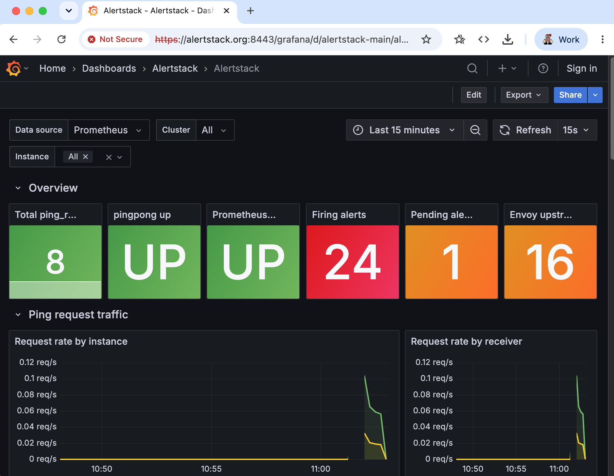 | 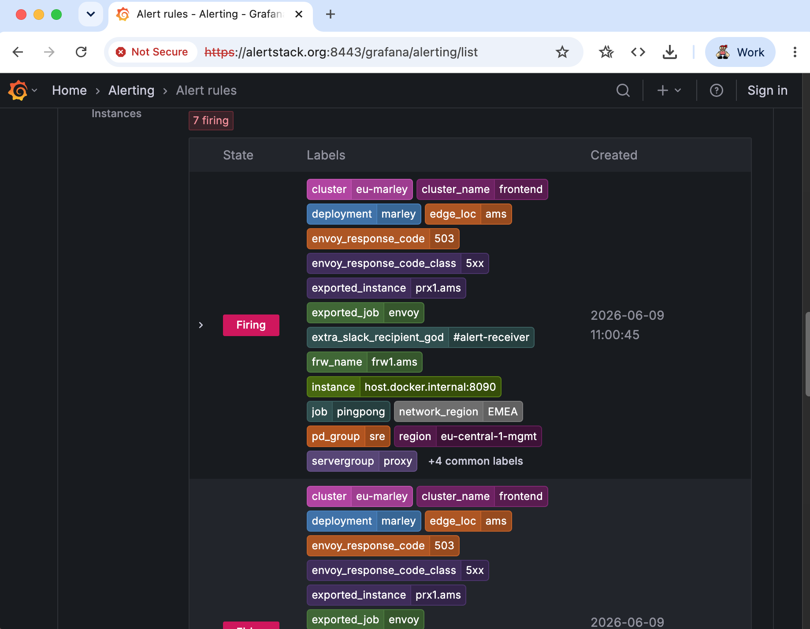 |
| **Alertmanager** - routing and silences | **Prometheus** - raw query and target health |
| 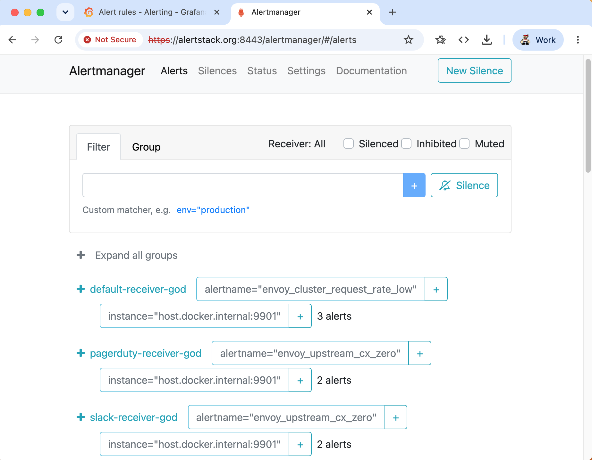 | 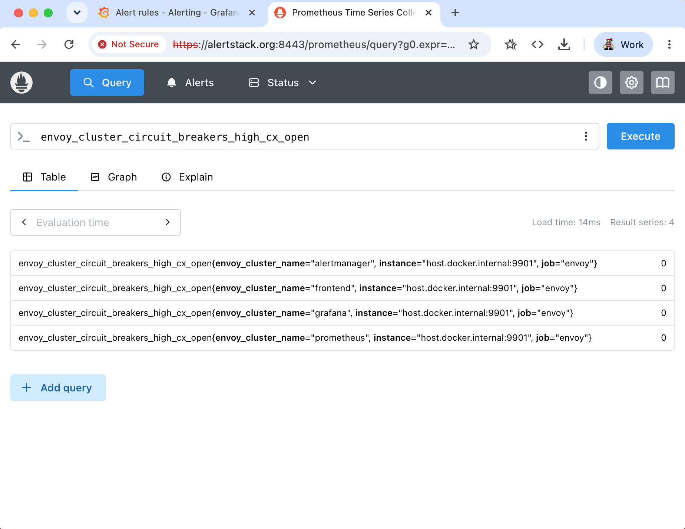 |

</details>

<br>

# Next steps

Open a terminal window somewhere and kick off some logging to see what is happening
```bash
make stack-logs
```

<br>

Send some /ping requests to our pingpong app. This will have the effect of incrementing the internal `ping_request_counter`. You can optionally give it a path to use if you like.

Remember you can observe all of this in the log output.
```bash
curl -k https://alertstack.org:8443/ping
# or

curl -k 'https://alertstack.org:8443/ping?path=/tmp/consul_members'
# or

curl -k 'https://alertstack.org:8443/ping?path=/tmp/consul_members&receiver=slack-receiver-abcdef'
```

Check out the metrics that the pingpong app displays. This is the same endpoint that Prometheus will scrape. You should see the `ping_request_counter` increment each time you hit `/ping`.

```bash
# view raw Prometheus metrics
curl -k --silent https://alertstack.org:8443/metrics

# parse and pretty-print with prom2json (install: go install github.com/prometheus/prom2json/cmd/prom2json@latest)
curl -k --silent https://alertstack.org:8443/metrics | prom2json | jq
```

<hr>

<br>

# RULES and ALERTS - Testing them out


Remembering the purpose of this effort is to make it easier to develop, standardise, create and manage alert and monitoring rules and receivers across the different Observability systems typically in use across companies. This is a key part of streamlining our incident management and reliability efforts.

In this case we are concerned with Prometheus and Alertmanager. Prometheus takes a user defined set of rules that defines alerts [note It is pretty common to see the words rules and alerts used interchangeably]

So in this case we define our test set of rules/alerts in [prometheus/rules.yml](prometheus/rules.yml). Prometheus then makes use of this [rules file](prometheus/rules.yml) in the rules section of the prometheus configuration file called [prometheus/prometheus.yml](prometheus/prometheus.yml)

<br>

### A look at some rules and alerts file pieces.

From [prometheus/rules.yml](prometheus/rules.yml) - Envoy upstream errors:

```yaml
groups:
  - name: envoy_cluster_errors
    rules:
      - alert: envoy_cluster_errors
        expr: envoy_cluster_upstream_rq_total{envoy_response_code_class="5xx"} == 6
        for: 30s
        labels:
          severity: critical
          extra_slack_recipient_god: "#alert-receiver"
          pd_group: sre
          sn_group: SRE - NOC
        annotations:
          summary: "Envoy upstream cluster 5xx spike on {{$labels.cluster_name}}"
          description: "Cluster {{$labels.cluster_name}} recorded {{$value}} 5xx responses (code {{$labels.envoy_response_code}})"
          logs_url: "https://alertstack.org:8443/logs?cluster={{$labels.cluster_name}}"
          grafana_url: "https://alertstack.org:8443/grafana/d/alertstack-main/alertstack?orgId=1&from=now-15m&to=now&timezone=browser&var-cluster={{$labels.cluster}}"
          dashboard_url: "https://alertstack.org:8443/grafana/d/alertstack-main"
          runbook_base: "https://alertstack.org:8443/runbooks/envoy-cluster-errors"
```

From [prometheus/alerts-mesh-team.yml](prometheus/alerts-mesh-team.yml) - service health with multi-recipient routing:

```yaml
groups:
  - name: front_office_disk_critical
    rules:
      - alert: front_office_disk_critical
        expr: front_office_disk_space{front_office_disk_space="0"} < 10
        for: 10s
        labels:
          severity: critical
          pd_group: sre
          extra_slack_recipient: "#alert-receiver"
          extra_slack_recipient_1: "#prom-sre"
        annotations:
          description: "Front office instance `{{$labels.instance}}` disk space is critically low at `{{$value}}`."
          summary: "Front office disk space critical on `{{$labels.instance}}`"
          logs_url: "https://alertstack.org:8443/logs?instance={{$labels.instance}}"
          grafana_url: "https://alertstack.org:8443/grafana/d/alertstack-main/alertstack?orgId=1&from=now-15m&to=now&timezone=browser&var-cluster={{$labels.cluster}}"
          runbook_base: "https://alertstack.org:8443/runbooks/front-office-disk"
          dashboard_url: "https://alertstack.org:8443/grafana/d/alertstack-main"
```

The annotation URLs in these rules are not static - they are templated with label values (cluster name, instance, listener) so that each firing alert links directly to the relevant slice of data. Clicking through from a firing alert lands you on the right page with the right context already applied.

| | |
|---|---|
| 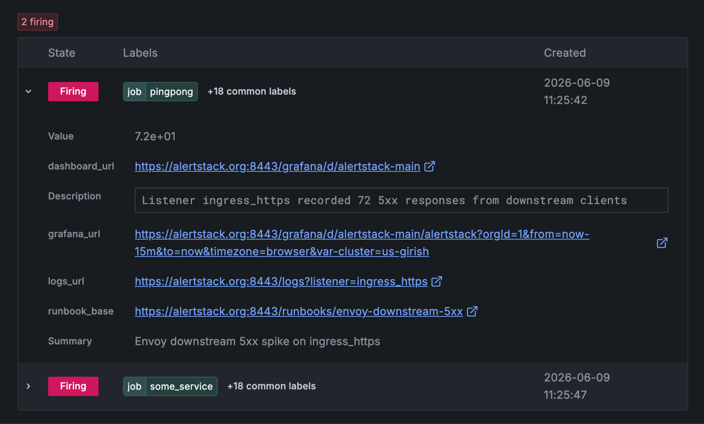 | 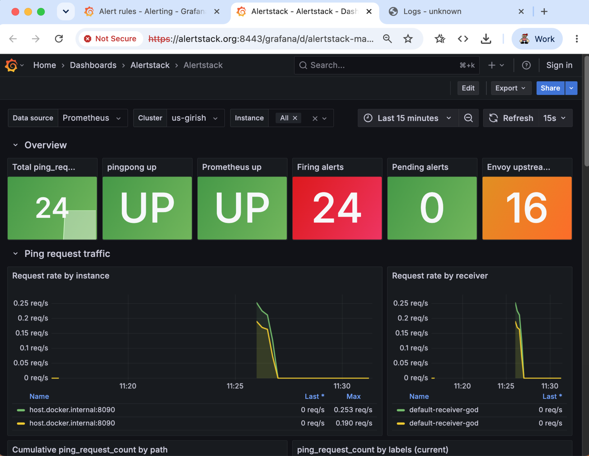 |
| A firing alert expanded in Alertmanager. The `grafana_url`, `logs_url`, `runbook_base` and `dashboard_url` annotations are all rendered as clickable links - each one pre-filtered to the specific job and cluster that triggered the alert. | The Grafana dashboard reached via `dashboard_url` / `grafana_url`. The cluster variable is injected from the alert label, so the dashboard opens already scoped to the affected service. |
| 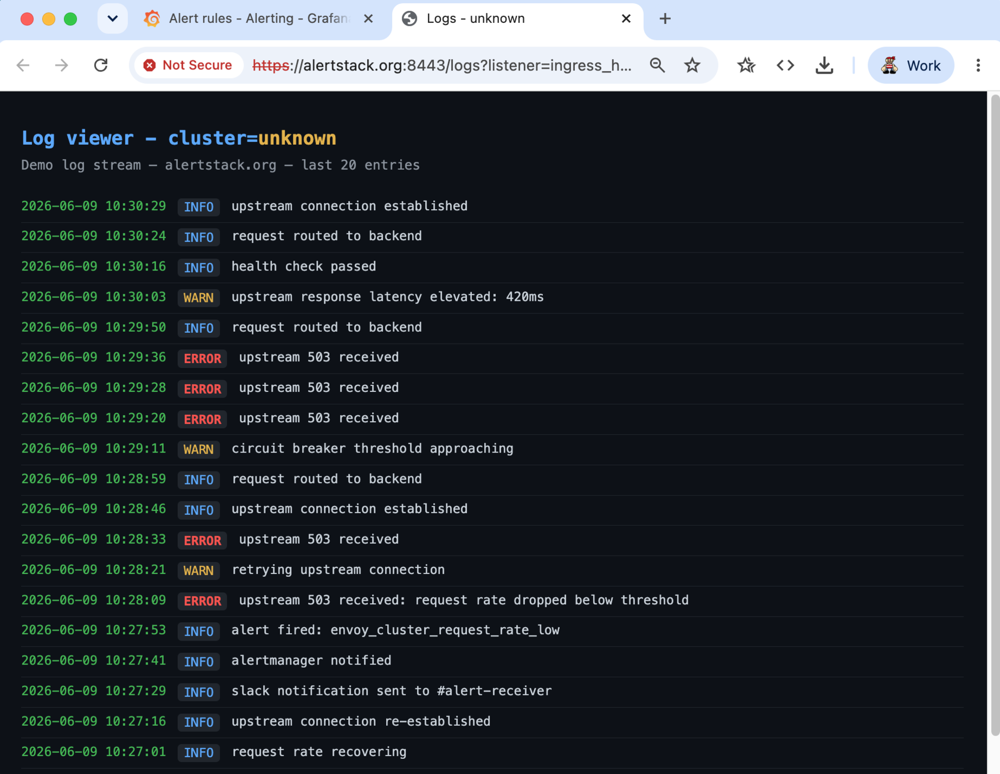 | 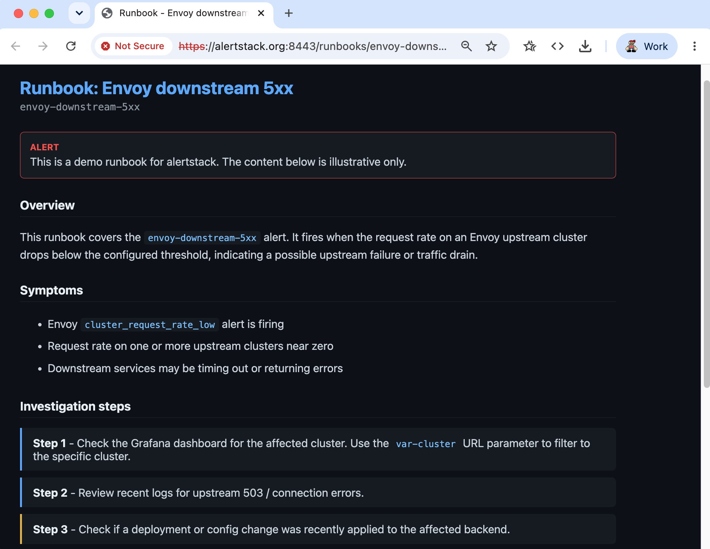 |
| The log viewer reached via `logs_url`, pre-filtered to the listener or instance named in the alert. Errors and warnings from the window leading up to the alert are immediately visible. | The runbook reached via `runbook_base`, specific to the alert type. Structured investigation steps give on-call engineers a starting point without needing to know the system from memory. |

<br>

## Some other useful tools and utilities for this type of thing

### [amtool] - alertmanager tool  [promtool] - promtool
```bash
amtool --alertmanager.url=https://alertstack.org:8443/alertmanager/ config show

# test the routes to see how they would resolve
amtool --alertmanager.url=https://alertstack.org:8443/alertmanager/ config routes

# test some routes with labels
amtool --verbose config routes test --config.file=alertmanager/alertmanager.yml  severity=warning extra_slack_recipient_test="#alert-receiver-sre"

# validate rules syntax
cd abcdef-alerts-staging-config
promtool check rules alerts/alerts_configuration/**/*
```


[Prometheus Client Exposition Format]: https://github.com/prometheus/docs/blob/main/content/docs/instrumenting/exposition_formats.md#exposition-formats

[openmetrics]: https://openmetrics.io/

[prom2json]: https://github.com/prometheus/prom2json

[docker-compose]: https://docs.docker.com/compose/

[mttr]: https://sre.google/workbook/how-sre-relates/#move-fast-by-reducing-the-cost-of-failure

[mtt*]: https://static.googleusercontent.com/media/sre.google/en//static/pdf/IncidentMeticsInSre.pdf

[amtool]: https://github.com/prometheus/alertmanager?tab=readme-ov-file#amtool

## Useful links and resources

[promtool]: https://prometheus.io/docs/prometheus/latest/installation/

[amtool]: https://github.com/prometheus/alertmanager?tab=readme-ov-file#amtool

[jq](https://jqlang.github.io/jq/download/)&nbsp;&nbsp;&nbsp; [yq](https://mikefarah.gitbook.io/yq)

[prom2json](https://github.com/prometheus/prom2json)

[SRE Glossary](https://sre.google/workbook/index/)

[SRE Booklist](https://sre.google/books/)

[SRE at Google](https://sre.google/sre-book/table-of-contents/)

[Incident Metrics in Google](https://sre.google/resources/practices-and-processes/incident-metrics-in-sre/)

[SRE Workbook](https://research.google/pubs/the-site-reliability-workbook/)&nbsp;&nbsp;&nbsp;[SRE Workbook](https://sre.google/workbook/table-of-contents/)

[ERR_CERT_AUTHORITY_INVALID]:https://github.com/chromium/chromium/blob/1471dcf45d95068bb476b06bcebdbb9acde8d996/net/base/net_error_list.h#L529

[NET::ERR_CERT_AUTHORITY_INVALID]:https://github.com/chromium/chromium/blob/1471dcf45d95068bb476b06bcebdbb9acde8d996/net/base/net_error_list.h#L529

[thisisunsafe]:https://chromium.googlesource.com/chromium/src/+/d8fc089b62cd4f8d907acff6fb3f5ff58f168697/components/security_interstitials/core/browser/resources/interstitial_large.js#19
